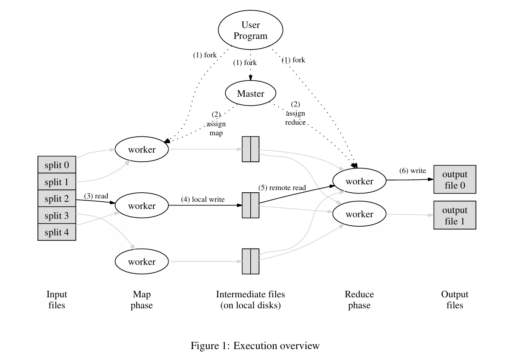
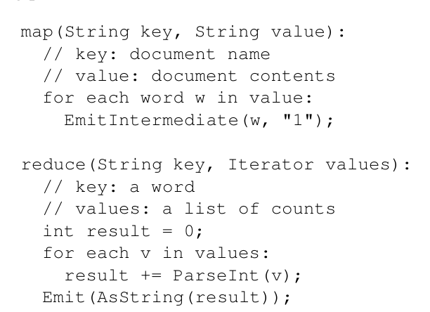

# MapReduce Paper

Paper link: https://static.googleusercontent.com/media/research.google.com/en//archive/mapreduce-osdi04.pdf

## What is MapReduce?

It is a programming model for processing and generating large datasets. Tasks as part of MapReduce are expressed as Map function and Reduce Function. 

Programs written in the form of Map and Reduce functions are automatically parallelized and executed on a cluster of machines.

Run-time system:
 * Responsible for partitioning the input data
 * Scheduling the program's execution across machines
 * Handle machine failures and inter-machine communication

Therefore a programmer can easily make use of distributed systems for processing without worrying about the complexities

### Need for Map-Reduce:

Even for simple computation tasks that need to be run in a distributed fashion, the issues of how to parallelize the computation, distribute the data, and handle failures obscure the original simple computation with large amounts of complex code to deal with these issues. 

Map Reduce is an abstraction that hides the messy details of parallelism, fault-tolerance, data distribution and load balancing in a library

## MapReduce Workflow Overview:

Map (Input records) -> Intermediate Key-Value Pairs -> Reduce (Values of Intermediate KeyValue pairs with common keys)

The Map phase is distributed as follows:

Input data is automatically partitioned into M splits.
These splits are distributed across multiple machines.
Each machine can process its assigned split in parallel with others.

### Partitioning of Map Output
Before the reduce phase, partitioning of the map output takes place on the basis of the key and sorted. This partitioning specifies that all the values for each key are grouped together and make sure that all the values of a single key go to the same reducer.

The user specifies both R (number of partitions) and the partitioning function. The partitioning is typically done using a partitioning function: hash(key) mod R

### Steps in the MapReduce process:

1. MapReduce library in the user program splits the input file into M splits (16 to 64MB per piece)
2. Many user program copies are then started in a cluster of machines. 1 copy -> Master. Rest -> Workers. In total we have M map tasks and R reduce tasks to be completed by the workers.
3. Worker with Map Tasks read the corresponding input split, get the key value pairs and pass them to the map function of the user program. Output: Intermediate Key Value pairs which are buffered in memory
4. The buffered intermediate key value pairs are written to local disks partitioned into R regions by the partitioning
function.. The location of these on the local disks are then sent to the Master Node which is responsible for forwarding them with the reduce workers.
For each map task and reduce task, the Master stores the state of the task - idle, in-progress, completed and the identity of the worker machine (for non-idle tasks)

5. Once the reduce worker is notified by the Master about the locations, the buffered intermediate key value pairs are read from the local disk using Remote Procedure Calls
6. After reading all the data, the reduce worker sorts the data by the keys so that same keys are grouped together
7. After this the reduce worker iterates over the sorted data and when a unique key is encountered, the key along with the corresponding set of values are passed to the Reduce function. The output of this is appended to an output file for this reduce partition.
<i>Within a given partition, it is guaranteed that the intermediate key/value pairs are processed in increasing key order. This ordering guarantee makes it easy to generate a sorted output file per partition, which is useful when the output file format needs to support efficient random
access lookups by key</i>

8. After all the map reduce tasks are completed, the Master wakes up the User Program

9. There will be R output files (one per reduce task). These can be combined using another MapReduce Program or by utilizing a distributed application that can deal with input partitioned into multiple files

### Problem due to stragglers
Stragglers -  a machine that takes an unusually long time to complete one of the last few map or reduce tasks in the computation.

When a MapReduce operation is close to completion, the master schedules backup executions of the remaining in-progress tasks. The task is markedas completed whenever either the primary or the backup execution completes. We have tuned this mechanism so that it typically increases the computational resources used by the operation by no more than a few percent.
This significantly reduces the time to complete large MapReduce operations.

## How Fault Tolerance is ensured?

### Worker Failure
1. Master keeps pinging the workers periodically. If no response received from the worker in a certain amount of time, the master marks the worker as failed 
2. Any in-progress map or reduce task on a failed worker are set to 'idle' state making it eligible for being scheduled to run on another worker.
3. Completed map tasks on failed workers need to be computed again since the intermediate key value pairs are stored on the local disk of the worker which would become inaccessible if the worker has failed. This is not the case with completed reduce tasks since the results are stored on the global file system. For a failed map worker, all reduce workers are notified of the re-execution on the new Map worker.

### Master Failure
The master checkpoints the master data structres periodically so that a new copy can be started from the last checkpointed state incase of failure. Since there is only one master node, there are very less chances of its failure but if it does fail then the MapReduce operation is aborted.

## Refinements made to MapReduce:

1. <b>Combiner</b>: Partial aggregation after map task can help to speed up certain MapReduce Operations
2. <b>Skipping Bad Records</b>: Optional mode in MapReduce which helps to determine the 'bad' records which would cause deterministic crashes and skips them in order to make progress forward.
3. <b>Status information of tasks</b>:  The master runs an internal HTTP server and exportsa set of status pages for human consumption. The status pages show the progress of the computation, such ashow many tasks have been completed, how many are in progress along with links to standard error and standard output files gen erated by each task. 
4. <b>Counter</b>: MapReduce library provides counter facility to count occurences of various events

## MapReduce Execution Overview

## MapReduce Word Counter Example Pseudocode

